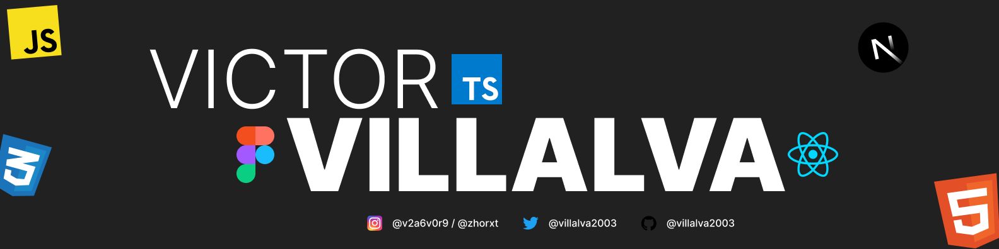

---

    
    <h1 align="center">Hi👋, I´m Victor Villalva </h1>
    <h3 align="center">
        I´m a front-end Developer, I can make a web interfaces, mobile interfaces and a little bit of everything too 🫰.
    </h3>

    

---

### 😎 About Me : 
- 📌 I know use **FIGMA** 

- 📌 I worked with **React-Vite, NodeJS**

- 📌 Ask me about **HTML, CSS, JAVA, BOOTSTRAP**

- 📌 I´m currently learnig **WebSockets, Python**

    <h3> ⚒ Languages and Tools : </h3>
    

        &nbsp;
        &nbsp;
        &nbsp;
        &nbsp;
        &nbsp;
        &nbsp;
        &nbsp;
        &nbsp;  
        &nbsp;  
    

    <h3> ⚒ Tools : </h3>
    

        &nbsp;
        &nbsp;
        &nbsp;
    

---

### 📊 My Stats 📊 : 

  
  

###

  

###

  

###

###

---

### ✍️ Random Dev Quote

---
### 🎵 My songs 🎵

  

###

